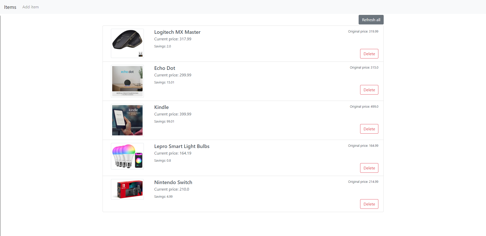

# Amazon Price Tracker


## Overview
A simple app to track price changes for items from Amazon. Allows you to add item to list by entering url to the item. This app will automatically look up the price and image on the page you provide and save it. Every time you open the app, the prices of the saved items will be automatically checked and any potential savings will be shown.

## Running
```
pip install -r requirements.txt
set FLASK_APP=app.py
flask run
```
